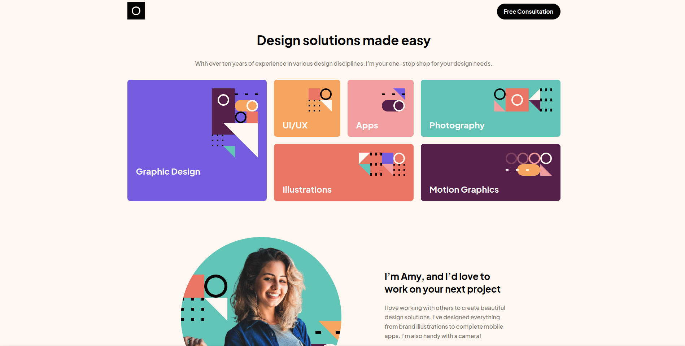

# Frontend Mentor - Single-page design portfolio solution

This is a solution to the [Single-page design portfolio challenge on Frontend Mentor](https://www.frontendmentor.io/challenges/singlepage-design-portfolio-2MMhyhfKVo). Frontend Mentor challenges help you improve your coding skills by building realistic projects. 

## Table of contents

- [Overview](#overview)
  - [The challenge](#the-challenge)
  - [Screenshot](#screenshot)
  - [Links](#links)
- [My process](#my-process)
  - [Built with](#built-with)
- [Author](#author)

## Overview

### The challenge

Users should be able to:

- View the optimal layout for the site depending on their device's screen size
- See hover states for all interactive elements on the page
- Navigate the slider using either their mouse/trackpad or keyboard

### Screenshot

### Links

- Solution URL: [Solution URL here](https://github.com/alfonso-ramos/single-page-design-portfolio)
- Live Site URL: [Live site](https://alfonso-ramos.github.io/single-page-design-portfolio/)

## My process

### Built with

- Semantic HTML5 markup
- CSS custom properties
- Flexbox
- CSS Grid
- Mobile-first workflow
- [SASS](https://reactjs.org/) - CSS preprocessor

## Author

- Website - [my website](https://www.ponchoramos.com)
- Frontend Mentor - [@alfonso-ramos](https://www.frontendmentor.io/profile/alfonso-ramos)